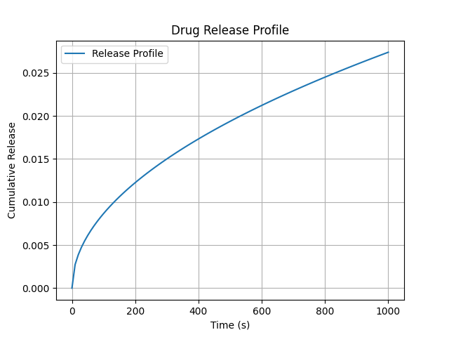

<div align="center">
    <h1>Drux: Drug Release Analysis Framework</h1>
    <br/>
    <a href="https://badge.fury.io/py/drux"></a>
    <a href="https://www.python.org/"></a>
    <a href="https://github.com/openscilab/drux"></a>
</div>

----------


## Overview
<p align="justify">
Drux is a Python-based framework for simulating drug release profiles using mathematical models. It offers a reproducible and extensible platform to model, analyze, and visualize time-dependent drug release behavior, making it ideal for pharmaceutical research and development. By combining simplicity with scientific rigor, Drux provides a robust foundation for quantitative analysis of drug delivery kinetics.
</p>
<table>
    <tr>
        <td align="center">PyPI Counter</td>
        <td align="center">
            <a href="https://pepy.tech/projects/drux">
                
            </a>
        </td>
    </tr>
    <tr>
        <td align="center">Github Stars</td>
        <td align="center">
            <a href="https://github.com/openscilab/drux">
                
            </a>
        </td>
    </tr>
</table>
<table>
    <tr> 
        <td align="center">Branch</td>
        <td align="center">main</td>
        <td align="center">dev</td>
    </tr>
    <tr>
        <td align="center">CI</td>
        <td align="center">
            
        </td>
        <td align="center">
            
            </td>
    </tr>
</table>
<table>
    <tr> 
        <td align="center">Code Quality</td>
        <td align="center">--</td>
        <td align="center">--</td>
    </tr>
</table>


## Installation

### PyPI
- Check [Python Packaging User Guide](https://packaging.python.org/installing/)
- Run `pip install drux==0.1`
### Source code
- Download [Version 0.1](https://github.com/openscilab/drux/archive/v0.1.zip) or [Latest Source](https://github.com/openscilab/drux/archive/dev.zip)
- Run `pip install .`

## Supported Models
### Higuchi Model [?]
The Higuchi model describes the release of a drug from a matrix system, where the drug diffuses through a porous medium.
The Higuchi equation addressed important aspects of drug transport and release from planar
devices. The formula is given by [?, ?]:

$
M_t =
\begin{cases} 
\sqrt{\frac{Dt}{\pi L^2}}, & \text{if } c_0 < c_s \\
\sqrt{D(2c_0 - c_s)c_st}, & \text{if } c_0 \ge c_s
\end{cases}
$

where:
- $M_t$ is the cumulative absolute amount of drug released at time $t$,
- $D$ is the drug diffusivity in the polymer carrier,
- $c_0$ is the initial drug concentration (total concentration of drug in the matrix),
- $c_s$ is the solubility of the drug in the polymer (carrier),
- $L$ is the film thickness.

#### Applications [?]
1. Matrix Tablets
2. Hydrophilic polymer matrices
3. Controlled- Release Microspheres
4. Semisolid Systems
5. Implantable Drug delivery systems

## Usage
### Higuchi Model
```python
from drux import HiguchiModel
model = HiguchiModel(D=1e-6, c0=0.5, cs=1.0, L=0.1)
model.simulate(duration=1000, time_step=10)
```
### Visualization
```python
model.plot(show=True)
```


## Issues & bug reports

Just fill an issue and describe it. We'll check it ASAP! or send an email to [drux@openscilab.com](mailto:drux@openscilab.com "drux@openscilab.com"). 

- Please complete the issue template


## Show your support


### Star this repo

Give a ⭐️ if this project helped you!

### Donate to our project
If you do like our project and we hope that you do, can you please support us? Our project is not and is never going to be working for profit. We need the money just so we can continue doing what we do ;-) .			

<a href="https://openscilab.com/#donation" target="_blank"></a>